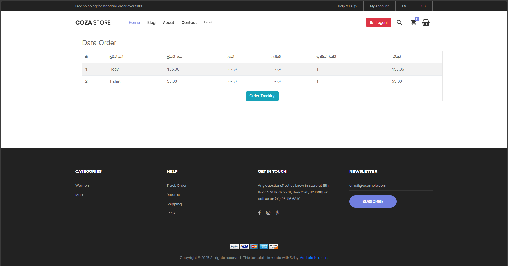

## About Project
### Laravel eCommerce System
A powerful and scalable eCommerce system built with Laravel 10 and MySQL, designed to manage products, <br>categories, orders, and payments efficiently. This project provides a complete solution for online store <br>owners, offering secure authentication, cart management, and seamless checkout processing.

## 🚀 Features
✅ User authentication & roles (admin, vendor, customer)<br>
✅ Product & category management<br>
✅ Shopping cart & order processing<br>
✅ Secure payment integration (Stripe, PayPal, etc.)<br>
✅ Order tracking & invoice generation<br>
✅ Admin dashboard for analytics & sales reports

## 🏗 Tech Stack
- **Backend:** Laravel 10, MySQL  
- **Frontend:** Blade, Bootstrap / Tailwind  
- **Authentication:** Custom Auth  
- **Storage:** Laravel FileSystem  
- **Payment:** Stripe  

## 📦 Installation
1. Clone the repo:
```sh
git clone https://github.com/MostafaHusseinAli20/ecommerce_laravel.git
cd ecommerce_laravel
```
2. Install dependencies:
```sh
composer install
npm install
```
3. Configure Environment:
```sh
cp .env.example .env
php artisan key:generate
```
4. Configure database & migrate:
```sh
php artisan migrate --seed
```
5. Run the server:
```sh
php artisan serve
```
## Screenshots





